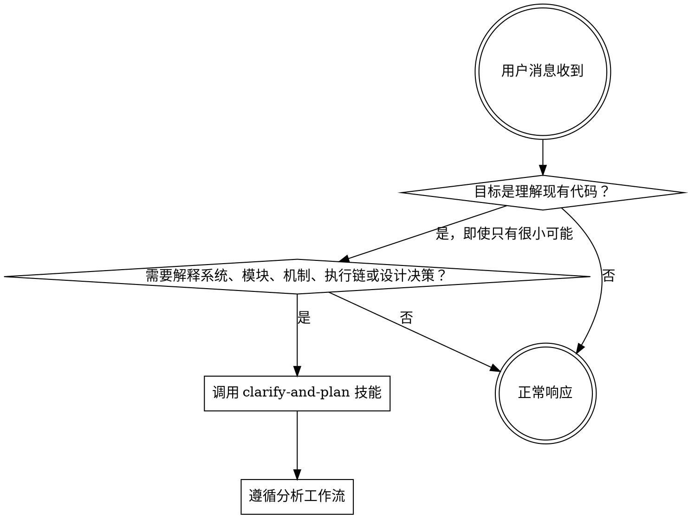

# 源码探索分析

<SUBAGENT-STOP>
如果你被派发为子代理来执行特定任务，跳过此技能。
</SUBAGENT-STOP>

<HARD-GATE>
此技能只负责把“理解现有源码”的任务导入结构化工作流，不执行任何源码探索、代码阅读或分析工作。
</HARD-GATE>

<EXTREMELY-IMPORTANT>
If the user's request involves understanding, exploring, explaining, or learning from existing source code, YOU DO NOT HAVE A CHOICE. YOU MUST USE THIS WORKFLOW.

当用户的请求目标是理解、探索、讲解、学习或系统化分析现有代码库时，你 ABSOLUTELY MUST 使用结构化分析工作流。

不要直接开始提澄清问题、读文件、搜索代码或下架构结论。这些动作看似高效，实际上会：
- 遗漏用户真正关心的问题
- 在无关代码上浪费 token
- 产出零散无组织的发现

正确做法：调用 `clarify-and-plan` 技能，让工作流先收敛目标、范围和讲解方式。

This is not negotiable. This is not optional. You cannot rationalize your way out of this.
</EXTREMELY-IMPORTANT>

## 入口契约

- **输入**：任何以理解现有源码为目标的请求，包括理解系统、模块、机制、执行链、设计决策、实现原理或模块关系。
- **本阶段职责**：识别这是一次源码理解任务，并把任务转交给 `clarify-and-plan`；本阶段不读取源码、不生成计划、不输出分析结论。
- **允许动作**：检查子代理模型偏好，并调用下一个技能。
- **禁止动作**：在进入工作流之前提出澄清问题、检索代码、阅读文件、分析架构，或直接给出源码结论。
- **输出**：交给 `clarify-and-plan` 的交接上下文，包括用户原始问题、尚未开始源码探索的状态、以及当前模型偏好。
- **交接规则**：后续阶段不得假设入口阶段已经完成任何源码阅读或问题澄清；入口阶段只做识别与分发。

## 触发决策流程

## 子代理模型配置

在调用 `clarify-and-plan` 之前，检查子代理模型偏好：

1. **检查配置文件**：读取 `docs/analyze-codebase/.preference`（如果存在）
2. **首次使用时询问**：如果文件不存在，向用户展示选择：
   > 源码分析过程中会派发子代理执行审查工作。请选择子代理模型偏好：
   > A) 快速经济模型 — 速度快，成本低
   > B) 标准模型 — 平衡质量与成本 **[默认]**
   > C) 最强模型 — 最高质量，成本最高
   >
   > 直接回车使用默认(B)，或输入 A/B/C。
3. **保存偏好**：将选择写入 `docs/analyze-codebase/.preference`，格式：`subagent_model: standard`
   - 值为：`fast-cheap` / `standard`（默认）/ `most-capable`

## 规则

**在做出任何澄清、检索、阅读或分析动作之前，调用 `clarify-and-plan` 技能。**

使用 Skill tool 调用 `clarify-and-plan`。这是唯一正确的下一步。

## Red Flags

以下想法意味着你应该停下来：

| 想法 | 现实 |
|-----|------|
| "我直接先看看项目结构" | 无结构的浏览会浪费 token。先澄清用户意图。 |
| "先读 README 快速了解一下" | 这是探索行为，属于执行分析阶段。 |
| "用户的问题很明确，不需要计划" | 你以为的明确不等于真正的明确。让工作流验证。 |
| "我先用 codebase-retrieval 搜一下" | 搜索策略应基于计划。先做计划再搜索。 |
| "这只是个简单问题" | 简单问题也会触发无序探索。用结构化流程。 |
| "我可以直接读文件回答" | 没有计划的阅读会遗漏重要内容。先用工作流。 |
| "用户要的是快速概览，不是深度分析" | 快速概览也受益于结构化澄清。让计划确定范围。 |
| "我直接搜索他问的函数就行" | 单函数搜索会遗漏架构上下文。先用工作流。 |
| "我需要先了解更多上下文" | 技能检查在澄清问题之前。先调用技能。 |
| "我记住了这个技能的内容" | 技能会更新。使用 Skill tool 加载当前版本。 |
| "这个不需要正式的工作流" | 如果技能存在，就用它。 |
| "先做这一件小事再说" | 在做任何事之前先检查技能。 |
